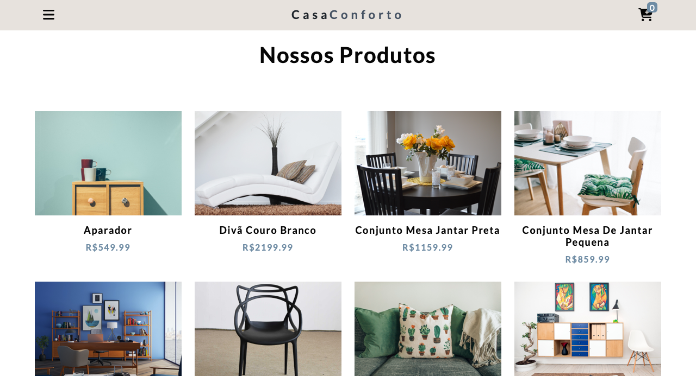
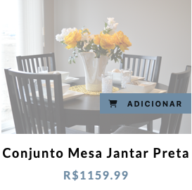
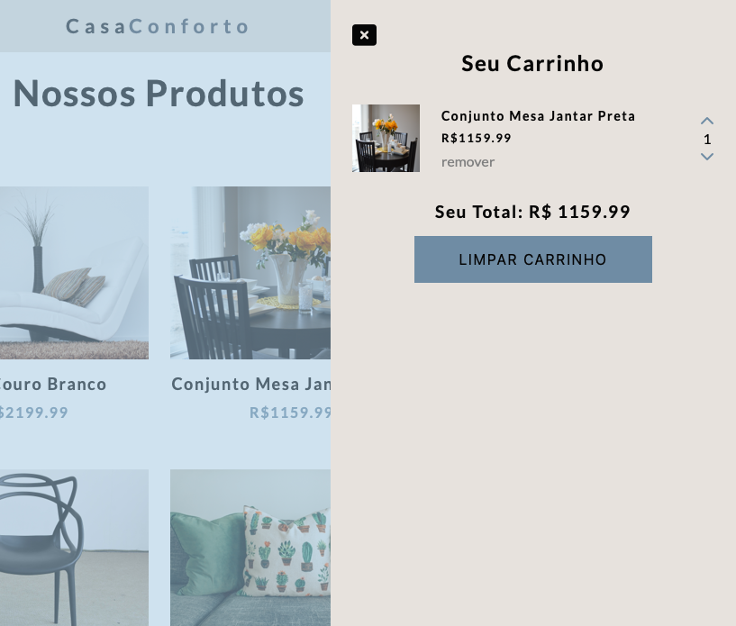
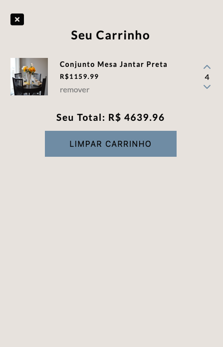
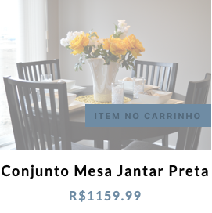

# CASA CONFORTO

This is a functional project made using JavaScript. User will be able to add items to cart, increase amount, remove item, clear cart, verify if the item is already in cart. The products are comingo from a personalized API and dynamically generated by JavaScript Vanilla. 

## Table of contents

- [Overview](#overview)
  - [Deploy](#deploy )
  - [The challenge](#the-challenge)
  - [Screenshots](#screenshot)
  - [My process](#my-process)
  - [Built with](#built-with)
  - [What I learned](#what-i-learned)
  - [Continued development](#continued-development)
  - [Useful resources](#useful-resources)
- [Author](#author)
- [Acknowledgments](#acknowledgments)

## Overview

### Deploy

https://shopping-site-cart.vercel.app/

### The challenge

The challenge on this product was to practice DOM manipulation, CRUD (create, remove, update, delete), local storage and API usage

### Screenshot

## My process

First I plan going throug what I wanted step by step. Then I started hard coding the HTML and CSS before I started the JavaScript so I could see things working as my work developed. I made more clear the path I was going throug and made dificulties more ease to overcome.

### Built with

- HTML
- CSS
- JavaScript
- API

### What I learned

Improved my skills working with logic, local storage, arrow functions, asynch and DOM manipulation

### Continued development

I now look forward going back on this project in a future so I can add more features to it

### Useful-resources

Contentful.com, 

## Author

Eduardo Vinagre (@eduvinagre)

## Acknowledgments

